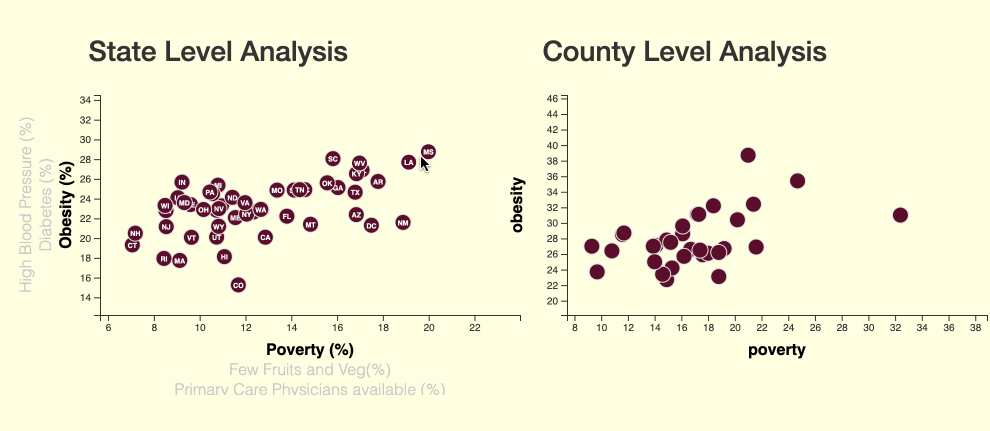
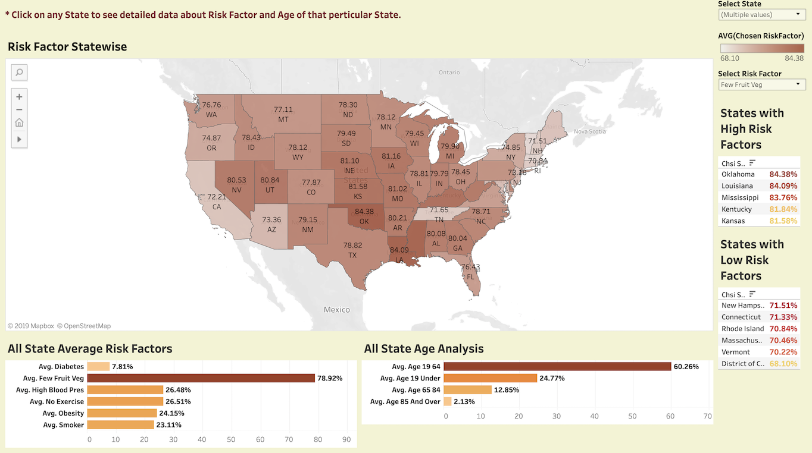

# Community Health Status Indicators(CHSI) Correlations

This goal of this project was to observe the correlations between various CHSIs and its impact on other risks like High Blood Pressure, Diabetes etc. The Community Health Status Indicators (CHSI) data set is collected by the US Department of Health and Human Services and presents county-level data on population demographics and health factors. This is very rich dataset. It contains various riskfactors, demographic data, data related to preventive care and access to care and much more. For this project, only Demographic and Risk Factor data have been considered. 

Visualization shows Demographic and Risk factor data (Obesity, Smoker, High blood pressure, Diabetes, Few fruits and vegetables) by state as well as county. User has an option to change the risk factor and visualize as well as it gives good 5 and worst 5 states for that risk factor.
It allows users to select and explore several data attribtues simultaneously via Choropleths, Bar charts, and a data table.
User can visualize the state and county level data on bubble plot as well with interactive axes.

Heroku deployed Site: http://bhavini-chsi-correlations.herokuapp.com/

### Technology stack used in developing this web application is as follows:

* Back End: 
  * Pandas
  * Python 3.6
  * Flask
  * PostgreSQL
  * SQLAlchemy ORM
  * Heroku

* Front End: 
  * HTML/CSS/Bootstrap
  * Javascript
  * JS libraries used for plotting: D3.js,
  * Visualization Tool: Tableau

### Images from the final app
* Visualizations with different RiskFactors using interactive axes.
    * Click on axis to see correlations with various risk factors at state level.
    * Click on bubble to see the correlations with chosen risk factor at county level. 

* Visualization shows Demographic and Risk factor data (Obesity, Smoker, High blood pressure, Diabetes, Few fruits and vegetables) by state as well as county. 
* User has an option to change the risk factor and visualize as well as it gives good 5 and worst 5 states for that risk factor.

### Some Insights
* It seems Colorado and Utah are having less Obesity and Diabetes rate. While Missisipi and West Virginia are having higher Obesity and Diabetes rate.
* From data, It seems there is not a correlation having less fruit and vegetable intake with Obesity and Diabetes.
* While form the chart, it is clear that exercite correlates to Obesity and Diabetes very well.
* Also poverty has correlations with High Blood Pressure.

## Special Note
Please note that this project requires a URI string to be saved as a config variable in Heroku as 'DATABASE_URL'.

